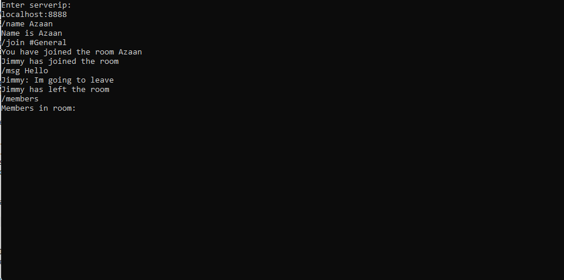
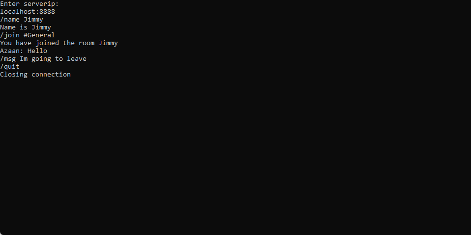
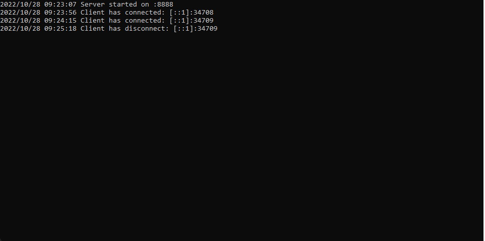

# Golang TCP Chat 




This project is a `TCP Chat` written in Go and contains both a cilent and a server.

### Prerequisites
* Go


### Building

This has only been tested on Windows. To compile the project, run the following commands :

```
cd Server
go build
cd ..
cd Client
go build
```

## Usage
Note: The server is locked to localhost:8888 but you may easily change this in the code.

Run the Server.exe then Client.exe
```
Server.exe
Client.exe //in another cmd
Enter serverip:
localhost:8888
```

##Commands
```
/msg message   #Broadcasts a message to everyone in room
/join roomName #Joins a room (creates one if not exists)
/name Name     #Changes user's name
/quit          #Closes Connection
/rooms         #Displays List of Rooms
/members       #Lists all members in the room (not including the client)
```


<!-- LICENSE -->
## License

Distributed under the MIT License. See `LICENSE.txt` for more information.